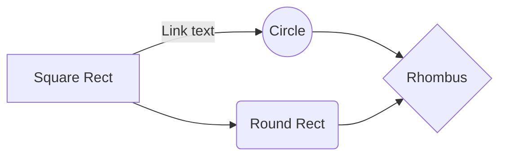

$$
\begin{aligned}
\frac{1}{2} \times \frac{1}{3} &= \frac{1}{6} \\
\frac{1}{2} \div \frac{1}{3} &= \frac{3}{2} \\
\frac{1}{2} \times \frac{1}{3} &= \frac{1}{6} \\
\frac{1}{2} \div \frac{1}{3} &= \frac{3}{2} \\
\frac{1}{2} \times \frac{1}{3} &= \frac{1}{6} \\
\frac{1}{2} \div \frac{1}{3} &= \frac{3}{2} \\
\frac{1}{2} \times \frac{1}{3} &= \frac{1}{6} \\
\frac{1}{2} \div \frac{1}{3} &= \frac{3}{2} \\
\frac{1}{2} \times \frac{1}{3} &= \frac{1}{6} \\
\frac{1}{2} \div \frac{1}{3} &= \frac{3}{2} \\
\end{aligned}
$$

```mermaid